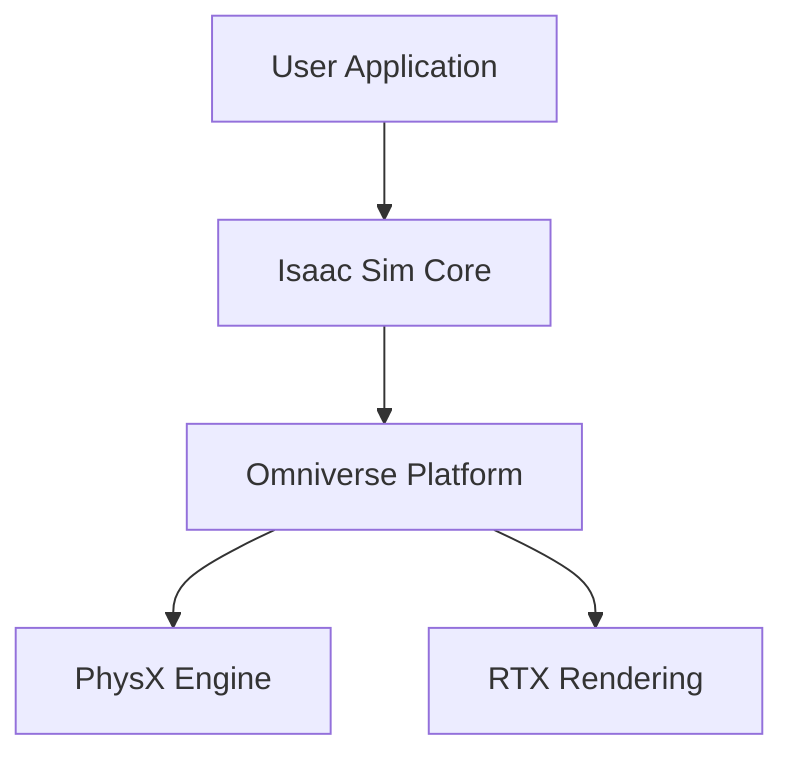
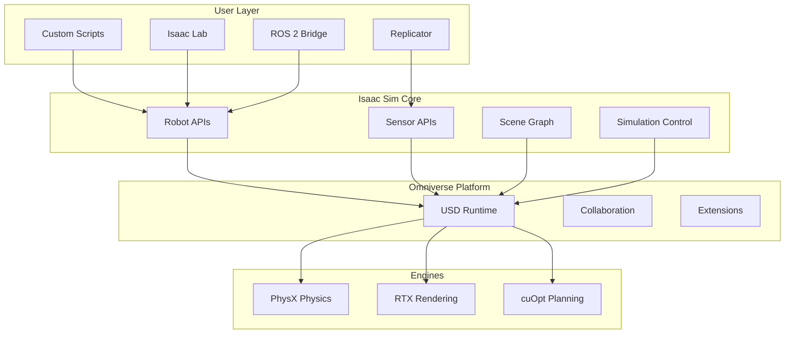
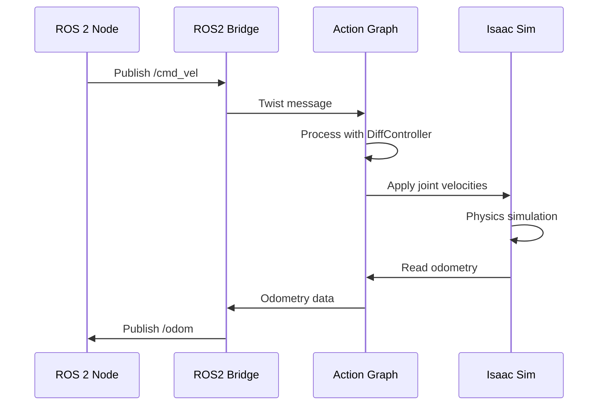
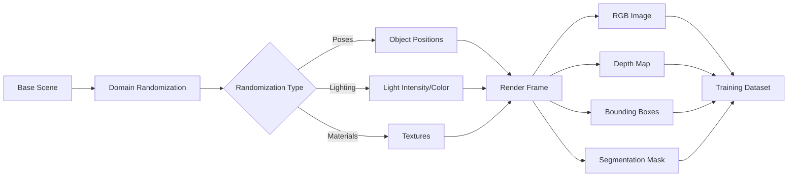

# Isaac Sim Diagrams

This directory contains diagrams for NVIDIA Isaac Sim architecture, perception, and navigation from Chapters 6-7.

## Recommended Diagrams

### Chapter 6: Introduction to NVIDIA Isaac Sim

1. **isaac_sim_architecture.png**
   - Layered architecture diagram
   - Shows: User Applications → Isaac Sim Core → Omniverse → Engines (PhysX, RTX)
   - Tools: Draw.io, Excalidraw, or Lucidchart

2. **isaac_vs_gazebo_unity.png**
   - Comparison chart
   - Columns: Gazebo, Unity, Isaac Sim
   - Rows: Physics, Rendering, GPU, ROS 2, Synthetic Data, RL, Multi-Robot

3. **usd_scene_graph.png**
   - USD scene hierarchy
   - Shows: World → Warehouse → Robot → Links → Joints → Sensors

4. **ros2_action_graph_example.png**
   - Visual representation of Action Graph
   - Nodes: OnTick → SubscribeTwist → DiffController → ArticController
   - Shows data flow with arrows

### Chapter 6 (continued): Machine Learning for Physical AI

5. **isaac_lab_architecture.png**
   - Isaac Lab training stack
   - Shows: Training Frameworks (SB3/RL Games) → Isaac Lab Envs → Isaac Sim → GPU Hardware

6. **rl_training_loop.png**
   - Reinforcement learning cycle
   - Shows: Policy → Parallel Environments → Rewards/Observations → Gradient Update → Policy

7. **domain_randomization_pipeline.png**
   - Domain randomization for sim-to-real
   - Boxes: Dynamics DR (mass, friction) + Perception DR (lighting, textures) → Robust Policy

8. **sim_to_real_workflow.png**
   - Complete sim-to-real transfer pipeline
   - Steps: Train in Isaac Lab → Export ONNX → Deploy ROS 2 → Real Robot

9. **synthetic_data_workflow.png**
   - Replicator workflow for perception training
   - Steps: Scene → Randomization → Capture → Annotations → Dataset → Train Model

### Chapter 7: Isaac Sim for Perception and Navigation

10. **rtx_sensor_pipeline.png**
    - Sensor data flow
    - Shows: Physical Scene → Ray Tracing → Sensor (Camera/LiDAR) → ROS 2 → RViz

11. **nav2_integration_diagram.png**
    - Nav2 architecture with Isaac Sim
    - Shows: Isaac Sim ↔ ROS 2 Bridge ↔ Nav2 Stack (AMCL, Planner, Controller)

12. **isaac_perceptor_stack.png**
    - Perceptor components
    - Boxes: Cameras → cuVSLAM → nvblox → Costmap → Nav2

## Creating Diagrams

### Option 1: ASCII Art (Quick Placeholder)

For rapid prototyping, use ASCII diagrams:

```
┌─────────────┐
│ Application │
└─────────────┘
      ↓
┌─────────────┐
│ Isaac Sim   │
└─────────────┘
      ↓
┌─────────────┐
│ Omniverse   │
└─────────────┘
```

### Option 2: Mermaid (Markdown-Compatible)

Use Mermaid.js for version-controlled diagrams:



Render with: https://mermaid.live/

### Option 3: Draw.io (Professional)

1. Visit https://app.diagrams.net/
2. Create flowcharts, architecture diagrams
3. Export as PNG (300 DPI)
4. Save source XML in this directory

### Option 4: Excalidraw (Hand-Drawn Style)

1. Visit https://excalidraw.com/
2. Draw diagrams with hand-drawn aesthetics
3. Export as PNG
4. Save .excalidraw file for editing

### Option 5: Screenshot from Isaac Sim

For Action Graphs and actual UI:

1. Open Isaac Sim
2. **Window → Visual Scripting → Action Graph**
3. Create graph as described in chapter
4. Screenshot with **Windows Key + Shift + S** (Windows) or **Shift + Cmd + 4** (Mac)
5. Annotate with arrows and labels

## Diagram Standards

- **Resolution**: Minimum 1920x1080 for screenshots, 300 DPI for vector exports
- **Format**: PNG with transparency where applicable
- **Labels**: Clear, readable at 50% zoom
- **Colors**: Use consistent color scheme across diagrams
- **File naming**: Lowercase with underscores (e.g., `isaac_sim_architecture.png`)

## Example Mermaid Diagrams

### Isaac Sim Architecture



### ROS 2 Integration Flow



### Synthetic Data Generation Pipeline



## Rendering Mermaid to PNG

```bash
# Install mermaid-cli
npm install -g @mermaid-js/mermaid-cli

# Render diagram
mmdc -i architecture.mmd -o isaac_sim_architecture.png -w 1920 -H 1080
```

## Placeholder Images

Until diagrams are created, the chapters reference conceptual diagrams. Replace these placeholders with actual images:

### Chapter 6: Isaac Sim & Machine Learning
- [ ] isaac_sim_architecture.png
- [ ] isaac_vs_gazebo_unity.png
- [ ] usd_scene_graph.png
- [ ] ros2_action_graph_example.png
- [ ] isaac_lab_architecture.png
- [ ] rl_training_loop.png
- [ ] domain_randomization_pipeline.png
- [ ] sim_to_real_workflow.png
- [ ] synthetic_data_workflow.png

### Chapter 7: Perception & Navigation
- [ ] rtx_sensor_pipeline.png
- [ ] nav2_integration_diagram.png
- [ ] isaac_perceptor_stack.png

## Tools Quick Links

- [Draw.io](https://app.diagrams.net/)
- [Excalidraw](https://excalidraw.com/)
- [Mermaid Live Editor](https://mermaid.live/)
- [Lucidchart](https://www.lucidchart.com/)
- [Figma](https://www.figma.com/)
- [PlantUML](https://plantuml.com/)
