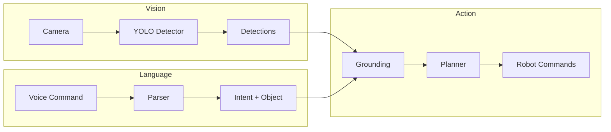
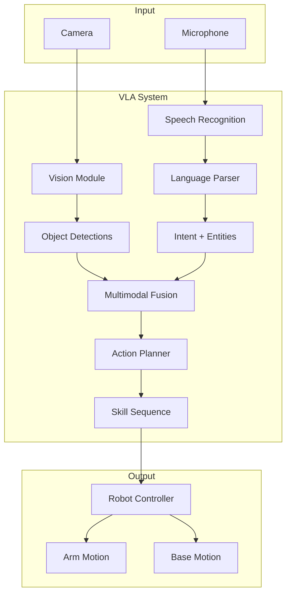
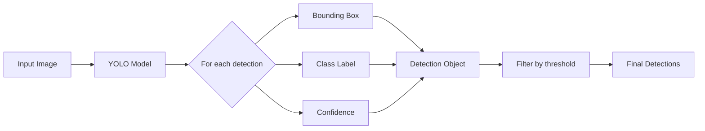
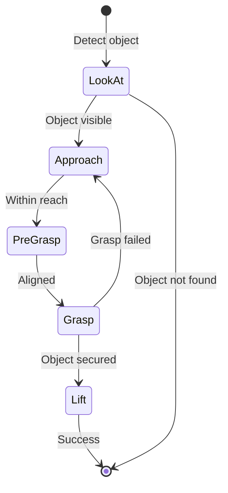
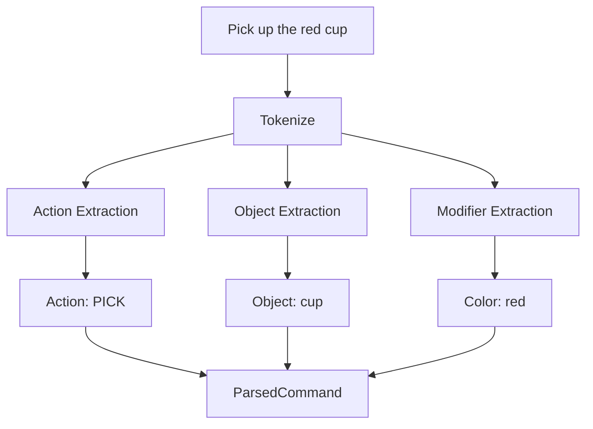

# VLA (Vision-Language-Action) Diagrams

This directory contains diagrams for Vision-Language-Action systems from Chapters 8-9.

## Recommended Diagrams

### Chapter 8: Vision-Language-Action Systems

1. **vla_pipeline_overview.png**
   - End-to-end VLA pipeline
   - Shows: Camera → Vision → Language → Action → Robot
   - Flow arrows with data labels

2. **vla_architecture.png**
   - Detailed VLA architecture
   - Components: Vision Module, Language Module, Action Module
   - ROS 2 topics and messages

3. **object_detection_pipeline.png**
   - YOLO detection workflow
   - Shows: Image → CNN → Feature Maps → Predictions → Bounding Boxes
   - Example detections annotated

4. **language_parsing_flow.png**
   - NLP command parsing
   - Shows: Text → Tokenization → Action Extraction → Entity Extraction → Parsed Command

5. **action_planning_sequence.png**
   - Skill decomposition for pick-and-place
   - Shows: Goal → Skills (Navigate, Approach, Grasp, Lift, Move, Place)
   - Preconditions and effects

6. **vision_grounding.png**
   - Connecting language to visual objects
   - Shows: "red cup" → Vision search → Matching detection → 3D position

### Chapter 9: LLM Planning and Voice Commands

7. **voice_command_pipeline.png**
   - Voice to robot action
   - Shows: Microphone → Speech Recognition → LLM → Action Planner → Robot

8. **llm_planning_architecture.png**
   - LLM-based task planning
   - Shows: Natural Language Goal → LLM Reasoning → Step-by-step Plan → Execution

9. **multimodal_fusion.png**
   - Vision + Language integration
   - Shows how visual context influences language understanding

10. **error_recovery_flow.png**
    - Handling failed actions
    - Shows: Failure Detection → Replanning → Retry Logic

## Creating Diagrams

### Option 1: Mermaid (Markdown-Compatible)



### Option 2: ASCII Art (In Markdown)

```
┌─────────────┐     ┌─────────────┐     ┌─────────────┐
│   Vision    │────▶│  Language   │────▶│   Action    │
│  Detector   │     │   Parser    │     │   Planner   │
└─────────────┘     └─────────────┘     └─────────────┘
       │                   │                   │
       ▼                   ▼                   ▼
   Objects &           Intent &            Motion
   Locations           Entities           Commands
```

### Option 3: Draw.io / Excalidraw

1. Visit https://app.diagrams.net/ or https://excalidraw.com/
2. Create flowcharts using the component names above
3. Export as PNG (300 DPI)
4. Save source files for editing

## Mermaid Diagram Examples

### VLA Pipeline



### Object Detection Flow



### Action Skill Decomposition



### Language Parsing



## Placeholder Image List

Until diagrams are created, the chapters use ASCII art. Replace with actual images:

### Chapter 8
- [ ] vla_pipeline_overview.png
- [ ] vla_architecture.png
- [ ] object_detection_pipeline.png
- [ ] language_parsing_flow.png
- [ ] action_planning_sequence.png
- [ ] vision_grounding.png

### Chapter 9
- [ ] voice_command_pipeline.png
- [ ] llm_planning_architecture.png
- [ ] multimodal_fusion.png
- [ ] error_recovery_flow.png

## Diagram Standards

- **Resolution**: Minimum 1920x1080 or 300 DPI
- **Format**: PNG with transparency
- **Colors**:
  - Vision: Blue tones
  - Language: Green tones
  - Action: Orange tones
  - Robot: Gray tones
- **Font**: Sans-serif, readable at 50% zoom
- **Arrows**: Clear direction, labeled where helpful

## Tools Quick Links

- [Draw.io](https://app.diagrams.net/)
- [Excalidraw](https://excalidraw.com/)
- [Mermaid Live Editor](https://mermaid.live/)
- [Lucidchart](https://www.lucidchart.com/)
- [Figma](https://www.figma.com/)

## Rendering Mermaid to PNG

```bash
# Install mermaid-cli
npm install -g @mermaid-js/mermaid-cli

# Render diagram
mmdc -i vla_pipeline.mmd -o vla_pipeline_overview.png -w 1920 -H 1080
```
